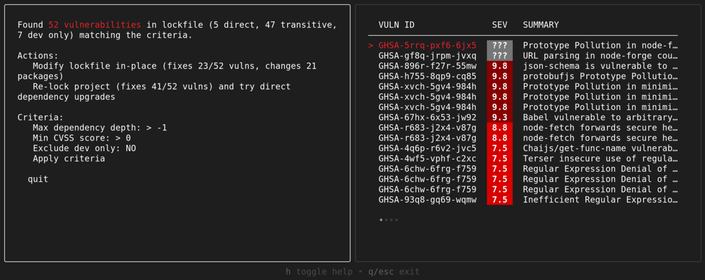

# Chad Hackerman

## Cybersecurity Professional | Penetration Tester

**Contact & Links**

[GitHub](https://github.com/chadhackerman "Security tools and open source projects") | [LinkedIn](https://linkedin.com/in/chadhackerman "Professional profile and endorsements") | [Blog](https://chadhacks.dev "Security research and technical writeups") | <chad@hackerman.io>

**Location:** Austin, TX | **Open to:** Remote, Hybrid, On-site

---

## Featured Projects

Detailed project documentation:

- [Automated Vulnerability Scanner](./projects/vuln-scanner.md) - Python network security tool with CVE integration

- [Network Defense Dashboard](./projects/defense-dashboard.md) - Real-time threat visualization and SIEM aggregation

- [Cybersecurity Homelab](./projects/homelab.md) - Complete infrastructure documentation

- [CTF Writeups Collection](./projects/ctf-writeups.md) - Competition solutions and methodologies

- [Incident Response Bot](./projects/ir-bot.md) - Slack automation for security incidents

---

## Professional Experience

### Senior Penetration Tester
**CyberDefense Corp** | *2023 - Present*

Conducted comprehensive security assessments for ***Fortune 500 clients***, identifying and remediating critical vulnerabilities before exploitation. Utilized `metasploit`, `burpsuite`, and `nmap` to conduct comprehensive security assessments across enterprise networks.

**Key Responsibilities:**
- Led **10+ red team engagements** simulating advanced persistent threats
- Reduced average incident response time by **60%** through automation
- Mentored **5 junior analysts** on penetration testing methodologies
- Achieved **zero security incidents** during 18-month engagement with major banking client
- Developed custom `Python` scripts for automated reconnaissance and vulnerability exploitation
- Implemented CI/CD security scanning using `GitLab CI` and `SAST`/`DAST` tools
- Managed infrastructure with `Terraform`, `Ansible`, and `Docker` for reproducible testing environments

**Notable Projects:**

- [Automated Vulnerability Scanner](https://github.com/chad-hackerman/vuln-scanner) - Python network security tool
  - Scans 500+ hosts per hour with custom CVE database integration
  - Reduced manual scanning time by 85%
  - Tech Stack: Python, Nmap, SQLite, Flask API

- [Network Defense Dashboard](https://github.com/chad-hackerman/netdefense) - Real-time threat visualization
  - Aggregates data from multiple SIEM sources
  - Custom alerting rules with Slack/Teams integration
  - Tech Stack: Python Flask, D3.js, PostgreSQL, Redis

**Technical Environment:** Kali Linux, Python, Bash, Docker, AWS, Metasploit Framework

### Junior Security Analyst
**SecureNet Solutions** | *2021 - 2023*

Performed security monitoring and incident response for enterprise clients. Analyzed security events and coordinated remediation efforts.

**Key Responsibilities:**
- Monitored security events using `Splunk` and `Security Onion`
- Responded to **100+ security incidents** with average resolution time of 4 hours
- Developed `Python` scripts for log analysis automation
- Conducted security awareness training for **200+ employees**

### IT Support Specialist
**TechStart Inc** | *2019 - 2021*

Provided technical support and maintained IT infrastructure for 500-person organization.

**Key Responsibilities:**
- Managed Windows Server environment and Active Directory
- Implemented patch management reducing vulnerabilities by **75%**
- Provided helpdesk support with **95% satisfaction rating**

---

## Technical Skills

### Security Tools & Platforms
- Penetration Testing: Metasploit, Burp Suite, Nmap, Wireshark
- SIEM: Splunk, ELK Stack, Security Onion
- Vulnerability Management: Nessus, OpenVAS, Qualys
- Network Security: pfSense, Snort, Suricata

### Programming & Scripting
- Python (Advanced) - Automation & Tool Development
- Bash Scripting - System Administration
- PowerShell - Windows Security Automation
- SQL - Database Security & Queries

### Operating Systems
- Linux (Kali, Ubuntu, CentOS) - Primary Environment
- Windows Server - Active Directory & GPO Management
- Virtualization: Proxmox, VMware, Docker

---

## Key Achievements

1. Discovered critical ***zero-day vulnerability*** in major enterprise software (responsibly disclosed, CVE-2023-XXXXX)
2. Reduced security incident response time by **60%** through custom automation scripts and process improvements
3. Led red team engagement that identified **23 critical vulnerabilities** before they could be exploited by threat actors
4. Trained and mentored **15+ junior analysts** on penetration testing methodologies and security best practices
5. Achieved OSCP, CEH, and Security+ certifications within single year while working full-time
6. Presented "Modern Web Application Security" at DEF CON 32 to audience of **500+ security professionals**

---

## Code Samples

### Python - Port Scanner

```python
#!/usr/bin/env python3
import socket
import threading
from queue import Queue

class PortScanner:
    def __init__(self, target, port_range):
        self.target = target
        self.port_range = port_range
        self.open_ports = []
        self.queue = Queue()
    
    def scan_port(self, port):
        try:
            sock = socket.socket(socket.AF_INET, socket.SOCK_STREAM)
            sock.settimeout(1)
            result = sock.connect_ex((self.target, port))
            if result == 0:
                service = socket.getservbyport(port)
                self.open_ports.append((port, service))
            sock.close()
        except:
            pass
    
    def worker(self):
        while not self.queue.empty():
            port = self.queue.get()
            self.scan_port(port)
            self.queue.task_done()
    
    def run(self, threads=100):
        for port in range(*self.port_range):
            self.queue.put(port)
        
        for _ in range(threads):
            t = threading.Thread(target=self.worker)
            t.daemon = True
            t.start()
        
        self.queue.join()
        return self.open_ports

# Usage
scanner = PortScanner('192.168.1.1', (1, 1000))
results = scanner.run()
print(f"Scan complete. Found {len(results)} open ports.")
```

### Bash - System Hardening Script

```bash
#!/bin/bash
# Linux server hardening automation
# Author: Chad Hackerman

set -euo pipefail

echo "[+] Starting system hardening process..."

# Update system packages
echo "[*] Updating system packages..."
apt update && apt upgrade -y

# Configure firewall
echo "[*] Configuring UFW firewall..."
ufw default deny incoming
ufw default allow outgoing
ufw allow 22/tcp
ufw allow 443/tcp
ufw --force enable

# Disable unnecessary services
echo "[*] Disabling unnecessary services..."
systemctl disable bluetooth.service
systemctl disable avahi-daemon.service

# Configure SSH hardening
echo "[*] Hardening SSH configuration..."
sed -i 's/#PermitRootLogin yes/PermitRootLogin no/' /etc/ssh/sshd_config
sed -i 's/#PasswordAuthentication yes/PasswordAuthentication no/' /etc/ssh/sshd_config
systemctl restart sshd

echo "[✓] System hardening complete!"
```

---

## Project Showcase

### Network Defense Dashboard


Real-time threat monitoring system built with Python Flask and D3.js. Aggregates data from multiple SIEM sources and provides instant security event visualization with custom alerting rules.

---

### Cybersecurity Homelab Setup


Personal security testing environment: Proxmox 8.1 cluster running on Dell R720 servers. Currently hosting pfSense, Security Onion, Kali Linux, and ELK Stack for hands-on practice.

---

### Vulnerability Scan Output



Sample output from my automated vulnerability scanner identifying critical findings across a test network. Color-coded severity ratings help prioritize remediation.

---

### Network Topology Diagram


Complete network architecture for my homelab environment demonstrating proper network segmentation and security zones.

---

## Education & Certifications

### Bachelor of Science in Cybersecurity
**Texas Tech University** | *2017 - 2021*
- GPA: 3.8/4.0
- Focus: Network Security, Penetration Testing, Digital Forensics

### Professional Certifications
- **OSCP** - Offensive Security Certified Professional (2023)
- **CEH** - Certified Ethical Hacker (2022)
- **Security+** - CompTIA Security+ (2021)
- **Network+** - CompTIA Network+ (2020)
- **Linux+** - CompTIA Linux+ (2020)

---

*Resume last updated: January 2025*
