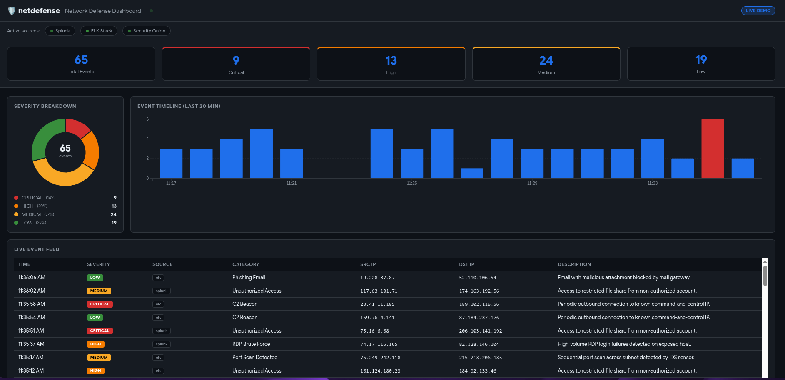

# Network Defense Dashboard

**Repository:** [View Source Code](https://github.com/chad-hackerman/netdefense) (**This would take you to the repository to the actual dashboard project**)

**Live Demo:** [Try It Out]((https://chad-hackerman.github.io/netdefense/)) 

**Status:** Production Ready

**Tech Stack:** Python Flask, D3.js, PostgreSQL, Redis

---

## Project Overview

Real-time threat visualization platform that aggregates security data from multiple SIEM sources into a unified dashboard.

**The Problem:** Security teams struggle to monitor multiple SIEM tools simultaneously, missing critical correlations across data sources.

**The Solution:** Centralized dashboard that:
- Aggregates data from Splunk, ELK Stack, and Security Onion
- Provides real-time threat visualization using D3.js
- Enables custom alerting rules with Slack/Teams integration
- Reduces mean time to detection by 40%

---

## Key Features

- **Multi-Source Aggregation** - Connects to Splunk, ELK, Security Onion simultaneously
- **Real-Time Visualization** - Live threat mapping with interactive D3.js charts
- **Custom Alerting** - Rule-based notifications via Slack, Teams, or email
- **Historical Analysis** - Query up to 90 days of security event data

---

## Technical Architecture

Flask backend with PostgreSQL for event storage. Redis for caching and real-time updates. D3.js frontend for interactive visualizations. RESTful API for external integrations.

---

## Screenshots

---

[← Back to Main Portfolio](../README.md)
