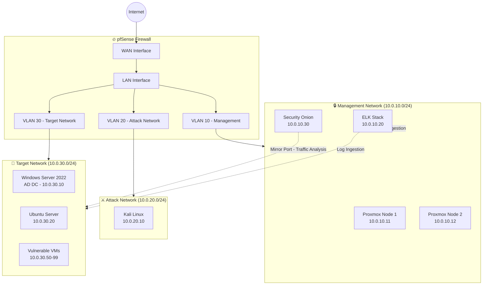

# Cybersecurity Homelab

**Documentation Status:** Complete

**Infrastructure Status:** Active

**Tech Stack:** Proxmox 8.1, pfSense, Security Onion, Kali Linux, ELK Stack

[Documentation](https://github.com/chad-hackerman/homelab)

---

## Project Overview

Complete security testing environment for hands-on practice with enterprise security tools and attack simulation.

**Purpose:** Create isolated environment for:
- Penetration testing practice
- Security tool evaluation
- Attack simulation and defense
- Certification exam preparation

---

## Infrastructure Components

### Hardware
- 2x Dell R720 servers (Proxmox cluster)
- 128GB RAM total
- 4TB storage (RAID 10)
- Dedicated gigabit switch

### Virtual Machines
- **pfSense** - Network firewall and routing
- **Security Onion** - Network security monitoring
- **Kali Linux** - Penetration testing platform
- **ELK Stack** - Log aggregation and analysis
- **Windows Server 2022** - Active Directory lab
- **Ubuntu Server** - Various web services

---

## Network Architecture

Three security zones:
- **Management Network** - Administrative access only
- **Attack Network** - Kali and offensive tools
- **Target Network** - Vulnerable systems for testing

---

## Learning Outcomes

Through this homelab, I've gained hands-on experience with:
- Enterprise firewall configuration and rules
- SIEM deployment and log analysis
- Network segmentation and VLANs
- IDS/IPS configuration and tuning
- Active Directory security hardening

---

## Photos

---

[← Back to Main Portfolio](../README.md)
