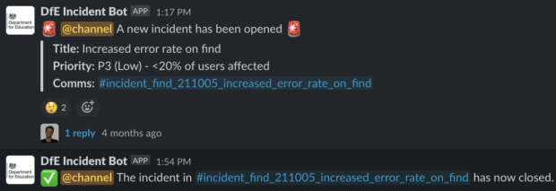

# Automated Incident Response Bot

**Repository:** [View Source Code](https://github.com/chadhackerman/ir-bot) (**This would take you to the actual repository**)

**Status:** Production Ready

**Tech Stack:** Python, Slack API, AWS Lambda, DynamoDB

---

## Project Overview

Slack bot that automates security incident triage and initial response coordination.

**The Problem:** Security incidents require coordination across multiple teams. Manual triage is slow and inconsistent.

**The Solution:** Automated bot that:
- Creates incident channels automatically
- Assigns roles (Incident Commander, Communications Lead, etc.)
- Provides triage runbooks and checklists
- Tracks incident timeline and updates
- Generates post-incident reports

---

## Key Features

- **Auto-Channel Creation** - New channel for each incident with proper permissions
- **Role Assignment** - Automatic assignment based on on-call schedule
- **Runbook Integration** - Context-aware playbooks based on incident type
- **Timeline Tracking** - Automated logging of all incident activities
- **Stakeholder Notifications** - Automated updates to leadership

---

## Technical Architecture

Python bot running on AWS Lambda. Triggered by Slack events. DynamoDB for incident state storage. Integration with PagerDuty for on-call scheduling.

---

## Impact Metrics

- Reduced mean time to response by **35%**
- Improved incident documentation completeness by **80%**
- Eliminated manual channel setup (saving 10-15 minutes per incident)
- In use for **100+ security incidents** across organization

---

## Screenshot

---

[← Back to Main Portfolio](../README.md)
